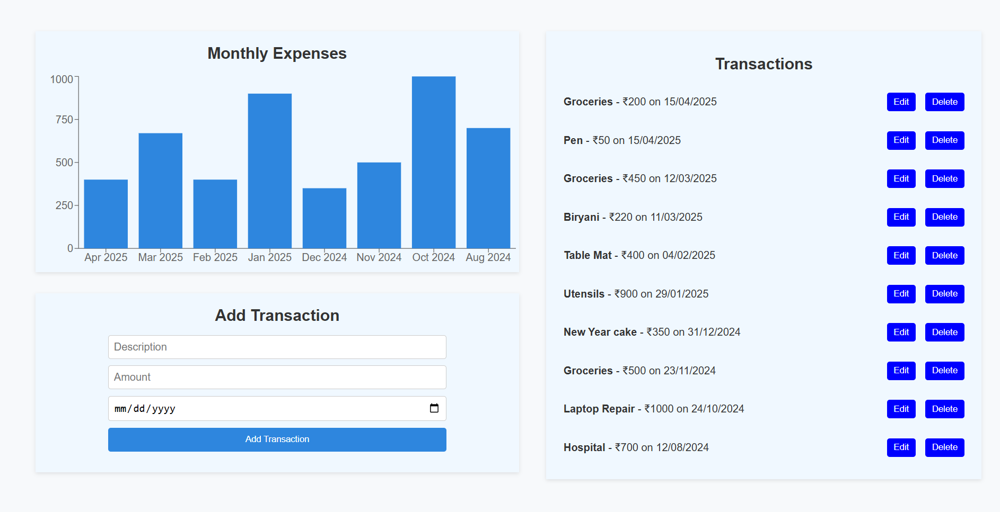

# 💰 Personal Finance Visualizer

A full-stack web application to help users track their personal finances. Built with React, Express.js, MongoDB, and Recharts. This submission covers **Stage 1: Basic Transaction Tracking** of the assignment.

---

## 🚀 Live Demo

- **Frontend (Vercel)**: [https://personal-finance-visualizer-sagarmaddelas-projects.vercel.app/](https://personal-finance-visualizer-sagarmaddelas-projects.vercel.app/)
- **Backend (Render)**: [https://personal-finance-visualizer-api.onrender.com](https://personal-finance-visualizer-api.onrender.com)

> Replace the above links with your actual deployed URLs

---

## 📌 Features - Stage 1

- ✅ Add, edit, delete transactions (amount, date, description)
- ✅ Transaction list view
- ✅ Monthly expenses bar chart
- ✅ Basic form validation (including prevention of negative values)
- ✅ RESTful API built with Express and MongoDB Atlas
- ✅ Responsive design with clean UI



---

## 💠 Tech Stack

**Frontend:**
- React (Vite)
- Recharts
- CSS Modules / Custom CSS
- Axios

**Backend:**
- Node.js
- Express.js
- MongoDB Atlas
- Mongoose
- CORS

---

## 🧑‍💻 Getting Started

### 1. Clone the repo

```bash
git clone https://github.com/SagarMaddela/Personal-Finance-Visualizer.git
cd personal-finance-visualizer
```

### 2. Backend Setup

```bash
cd backend
npm init -y
npm install express mongoose cors dotenv
# Create .env file with:
# MONGO_URI = your_mongo_connection_string
npm run dev
```

### 3. Frontend Setup

```bash
cd ../clien
npm install
npm install recharts axios react-router-dom
npm run dev
```

---

## 📂 Folder Structure

```
personal-finance-visualizer/
├── frontend/
│   ├── components/
│   ├── pages/
│   ├── styles/
│   └── main.jsx
├── backend/
│   ├── models/
│   ├── routes/
│   └── server.js
```

---

## 📸 Screenshots

> Add screenshots of:
- Add/Edit Transaction form
- Transaction list
- Expense chart

---

## 📄 License

This project is open source and available under the [MIT License](LICENSE).
