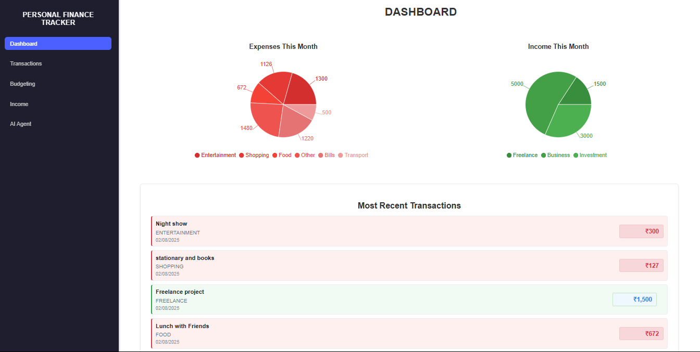
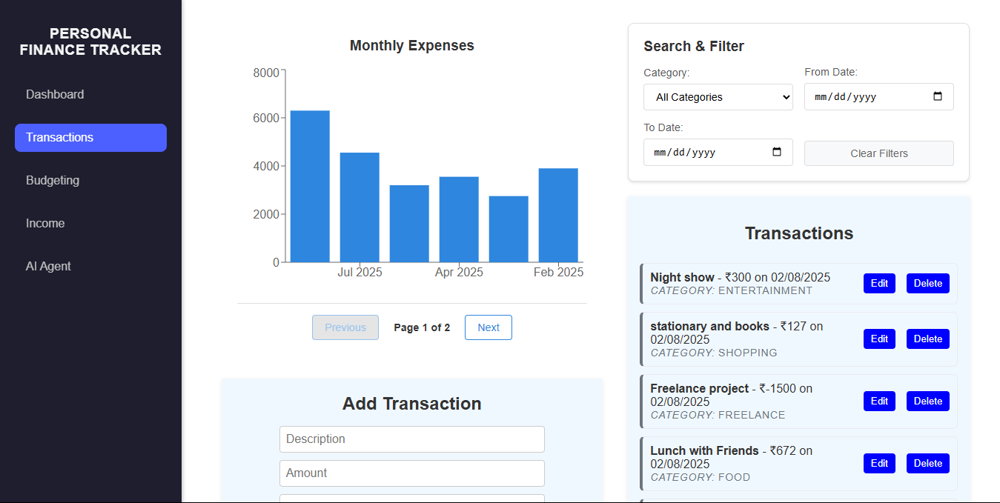
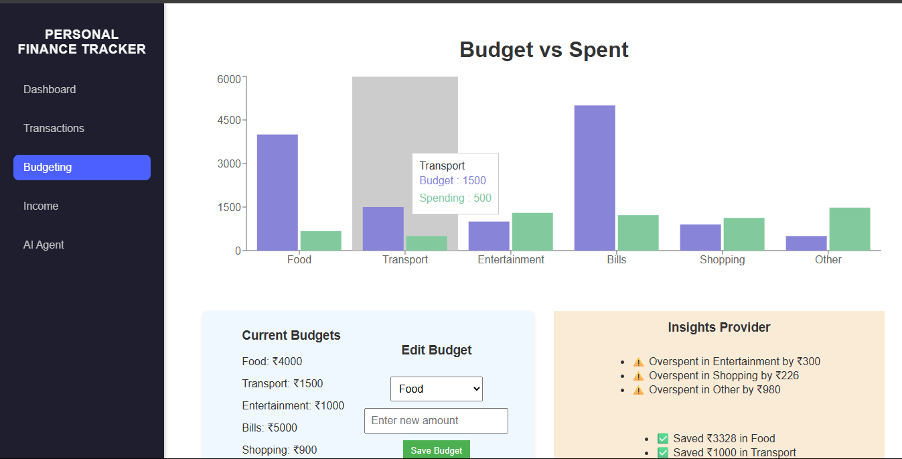
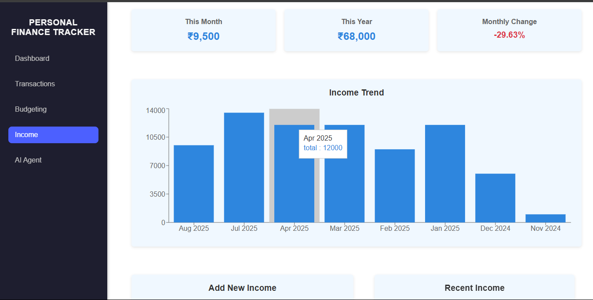
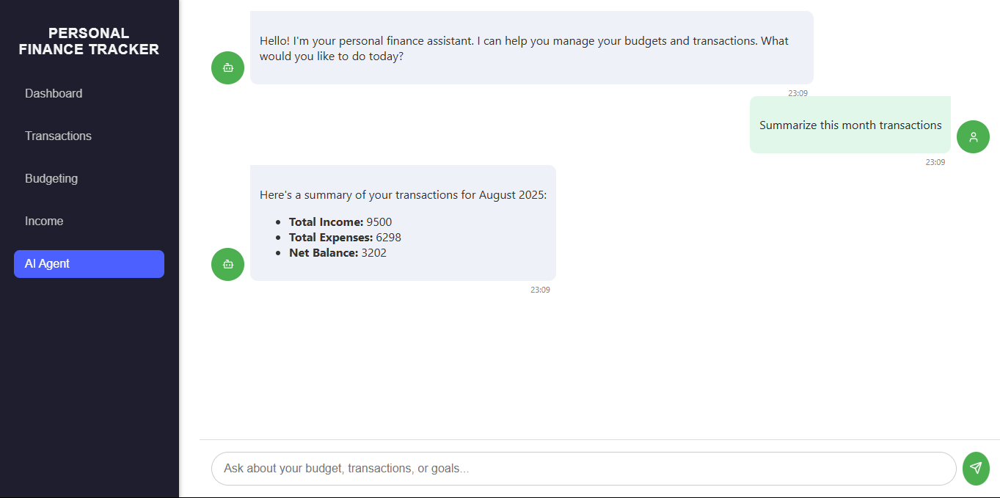

💸 Personal Finance Visualizer

A full-stack web application that helps users track transactions, set budgets per category, and visualize spending trends. This project was built as part of a full-stack internship assignment and includes interactive charts, real-time data visualization, and MongoDB integration.


---

## 🚀 Live Demo

- **Frontend (Vercel)**: [https://personal-finance-visualizer-sagarmaddelas-projects.vercel.app/](https://personal-finance-visualizer-sagarmaddelas-projects.vercel.app/)
- **Backend (Render)**: [https://personal-finance-visualizer-api.onrender.com](https://personal-finance-visualizer-api.onrender.com)


---

✨ Features

Core Features

✅ Add income and expense entries

✅ List all transactions in a given time range

✅ Filter and categorize transactions

✅ Visual graphs (e.g., Expenses by Category, Expenses by Date)

✅ Receipt upload (POS receipts in image or PDF format)

Bonus Features (Implemented)

⭐ AI Agent that let's user speak to thier transactions

⭐ Upload transaction history from tabular-format PDFs

⭐ Pagination support for list API











---

## 💠 Tech Stack

**Frontend:**
- React (Vite)
- Recharts
- CSS Modules / Custom CSS
- Axios

**Backend:**
- Node.js
- Express.js
- MongoDB Atlas
- Mongoose
- CORS

---

## 🧑‍💻 Getting Started

### 1. Clone the repo

```bash
git clone https://github.com/SagarMaddela/Personal-Finance-Visualizer.git
cd personal-finance-visualizer
```

### 2. Backend Setup

```bash
cd backend
npm init -y
# Create .env file with:
# MONGO_URI = your_mongo_connection_string
npm run dev
```

### 3. Frontend Setup

```bash
cd ../client
npm install
npm run dev
```
### 4. Agent Setup

```bash
cd ../Agent
python -m venv venv
venv/Scripts/Activate.ps1 #For powershell
pip install -r requirements.txt
uvicorn main:app --reload
# Create .env file with:
# GEMINI_API_KEY=your_gemini_key
---

## 📂 Folder Structure

```
Personal-Finance-Visualizer/
├─ Agent/
│  ├─ tools/
│  │  ├─ budget_tools.py
│  │  └─ transaction_tools.py
│  ├─ .env
│  ├─ main.py
│  └─ requirements.txt
├─ backend/
│  ├─ models/
│  │  ├─ Budget.js
│  │  └─ Transaction.js
│  ├─ routes/
│  │  ├─ budjets.js
│  │  ├─ receipts.js
│  │  └─ transactions.js
│  ├─ uploads/
│  ├─ .env
│  ├─ eng.traineddata
│  ├─ package-lock.json
│  ├─ package.json
│  └─ server.js
├─ client/
│  ├─ public/
│  │  └─ vite.svg
│  ├─ src/
│  │  ├─ assets/
│  │  │  └─ react.svg
│  │  ├─ components/
│  │  │  ├─ ExpenseChart.jsx
│  │  │  ├─ Loader.jsx
│  │  │  ├─ Navbar.jsx
│  │  │  ├─ PieChart.jsx
│  │  │  ├─ ReceiptUpload.jsx
│  │  │  ├─ SearchFilter.jsx
│  │  │  ├─ TransactionForm.jsx
│  │  │  ├─ TransactionList.jsx
│  │  │  └─ withLoading.jsx
│  │  ├─ context/
│  │  │  └─ LoadingContext.jsx
│  │  ├─ hooks/
│  │  │  └─ useLoading.js
│  │  ├─ pages/
│  │  │  ├─ Agent.jsx
│  │  │  ├─ BudgetingPage.jsx
│  │  │  ├─ Dashboard.jsx
│  │  │  ├─ IncomePage.jsx
│  │  │  └─ Transactions.jsx
│  │  ├─ styles/
│  │  │  ├─ Agent.css
│  │  │  ├─ budget.css
│  │  │  ├─ chart.css
│  │  │  ├─ dashboard.css
│  │  │  ├─ form.css
│  │  │  ├─ income.css
│  │  │  ├─ list.css
│  │  │  ├─ loader.css
│  │  │  ├─ navbar.css
│  │  │  ├─ receipt.css
│  │  │  └─ search.css
│  │  ├─ App.css
│  │  ├─ App.jsx
│  │  ├─ index.css
│  │  └─ main.jsx
│  ├─ .env
│  ├─ .gitignore
│  ├─ api.js
│  ├─ eslint.config.js
│  ├─ index.html
│  ├─ package-lock.json
│  ├─ package.json
│  ├─ README.md
│  └─ vite.config.js
├─ .gitignore
├─ image1.png
├─ image2.png
├─ image3.png
├─ image4.png
├─ image5.png
├─ LICENSE
└─ README.md


```

---

## 📄 License

This project is open source and available under the [MIT License](LICENSE).
